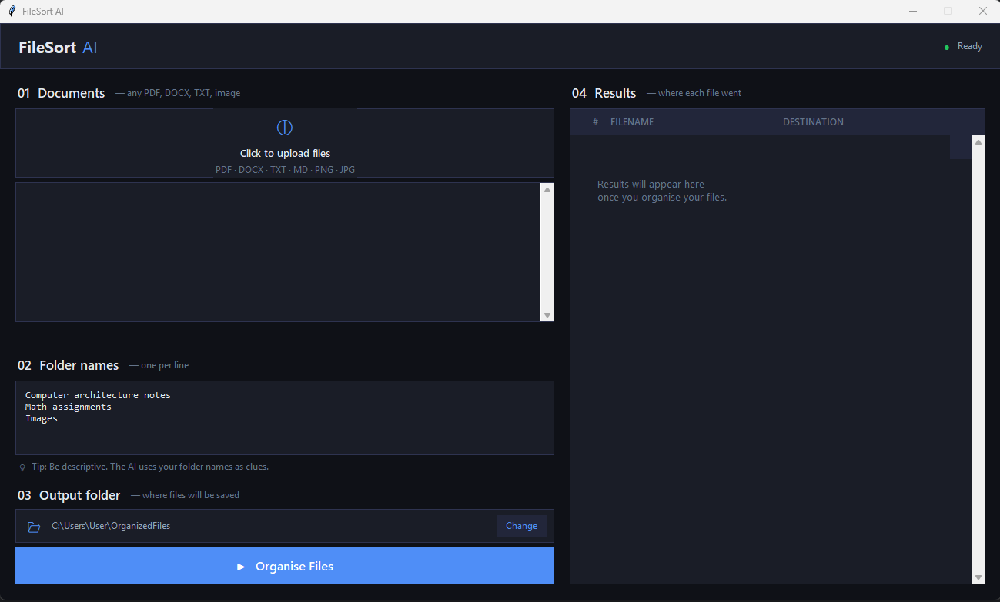

# 🗂️ FileSort AI

**FileSort AI** is a local, privacy-first desktop application that uses AI to automatically sort your documents into folders — no cloud, no subscriptions, no data leaving your machine.

You drop in files, type the folder names you want, hit **Organise**, and the AI reads each file's content and decides where it belongs.


---

## ✨ Features

- 📄 Supports **PDF, DOCX, TXT, MD, CSV, PNG, JPG, JPEG, WEBP**
- 🧠 AI classification powered by **Ollama** (runs 100% locally)
- 🖼️ Image understanding via multimodal model (`gemma4:e4b`)
- 🪟 Clean dark-themed desktop GUI built with **Tkinter**
- 📁 You define the folder names — the AI maps files to them
- ⚡ Multithreaded processing — UI stays responsive during sorting
- 🔒 Fully offline — your files never leave your computer

---

## 🧱 Project Structure

```
filesort-ai/
├── main.py          # GUI application (Tkinter)
├── extractor.py     # Reads file content (PDF, DOCX, images, text)
├── classifier.py    # Sends content to Ollama for AI classification
├── organizer.py     # Moves files to the correct output folder
└── requirements.txt # Python dependencies
```

---

## 🔄 How It Works

```
User selects files
       ↓
extractor.py → reads & extracts content from each file
       ↓
classifier.py → sends content + folder list to Ollama (gemma4:e4b)
       ↓
AI returns the best-matching folder name
       ↓
organizer.py → moves the file into that folder
       ↓
Results panel shows where each file was sent
```

1. **Extraction** — `extractor.py` reads the file. PDFs are read page by page (up to 8 pages), DOCX files extract paragraphs and tables, images are base64-encoded for multimodal inference, and plain text files are sampled head+tail to stay within context limits.

2. **Classification** — `classifier.py` builds a prompt containing the filename, the extracted content, and your list of folder names, then queries Ollama locally. The model is instructed to reply with only a single folder name.

3. **Organisation** — `organizer.py` moves the file into a subfolder of your chosen output directory. If no folder matches, the file is labelled `unsorted` and stays in the upload list.

---

## 🛠️ Prerequisites

### 1. Python 3.14

> ⚠️ **This project requires Python 3.14.**
> It was tested and found to be buggy on Python 3.12. Python 3.14 is strongly recommended.

Download Python 3.14 from: https://www.python.org/downloads/

---

### 2. Ollama

Ollama is the local AI runtime that runs the model on your machine.

**Install Ollama:**

```bash
# macOS / Linux
curl -fsSL https://ollama.com/install.sh | sh

# Windows
# Download the installer from: https://ollama.com/download
```

**Pull the required model:**

```bash
ollama pull gemma4:e4b
```

Make sure Ollama is **running** before you launch FileSort AI. You can verify with:

```bash
ollama list
```

---

### 3. Python Dependencies

Install the required packages:

```bash
pip install -r requirements.txt
```

**`requirements.txt`:**

```
ollama==0.4.7
PyMuPDF==1.25.1
python-docx==1.1.0
```

> ✅ These three packages cover everything the app needs: Ollama's Python client, PDF reading via PyMuPDF, and DOCX reading via python-docx. Tkinter is part of Python's standard library and does not need to be installed separately (though some Linux distros require `sudo apt install python3-tk`).

---

## 🚀 Running the App

```bash
python main.py
```

The GUI window will open. From there:

1. **Upload files** — click the upload zone to pick your files
2. **Set folder names** — type one folder name per line (e.g. `Invoices`, `Contracts`, `Reports`)
3. **Choose output directory** — defaults to `~/OrganizedFiles`
4. **Click "Organise Files"** — the AI processes each file and moves it

Results appear in the right panel showing each filename and its destination folder.

---

## ⚠️ Limitations

### Hardware Requirements
FileSort AI runs AI inference **locally on your machine**. This means:

- **RAM** — The `gemma4:e4b` model requires significant RAM. **16 GB minimum recommended**, 32 GB for comfortable performance.
- **GPU** — A dedicated GPU (NVIDIA with CUDA, or Apple Silicon with Metal) will make classification significantly faster. CPU-only is possible but slow, especially on large batches.
- **Disk space** — The model weights require several GB of storage (Ollama manages this automatically under `~/.ollama`).
- **Processing time** — Expect a few seconds per file on a GPU, and potentially 15–60+ seconds per file on CPU-only hardware.

### File Support
- Binary `.doc` files (old Word format) are **not supported**. Please convert them to `.docx` first.
- Password-protected PDFs cannot be read.
- Very large files are sampled (first 3000 + last 3000 characters for text; first 8 pages for PDFs) to keep inference fast.

### Classification Accuracy
- The AI is only as good as the folder names you provide. Clear, descriptive folder names yield better results.
- Files that don't match any folder will be placed in `unsorted`.
- The model output is fuzzy-matched against your folder list, so minor phrasing differences are handled gracefully.

### Platform
- Primarily developed and tested on **Windows**.
- Should work on macOS and Linux, but font tokens (`Segoe UI`, `Consolas`) may render differently — the app will still function.

---

## 🔮 Future Improvements

- [ ] **Drag-and-drop** file upload support
- [ ] **Batch undo** — move files back if classification was wrong
- [ ] **Custom model selection** — let the user pick any Ollama model from a dropdown
- [ ] **Folder auto-suggestion** — have the AI suggest folder categories based on the uploaded files before sorting
- [ ] **CSV export** of results (filename → destination log)
- [ ] **macOS & Linux UI polish** — cross-platform font and styling pass
- [ ] **Support for more file types** — XLSX, PPTX, EML, etc.
- [ ] **Confidence score display** — show how confident the AI was in each classification
- [ ] **Watch folder mode** — continuously monitor a folder and sort new files automatically
- [ ] **Settings panel** — configure model, output path, and sampling limits from the GUI

---

## 🧰 Tech Stack

| Component | Technology |
|-----------|-----------|
| GUI | Python `tkinter` / `ttk` |
| AI Runtime | [Ollama](https://ollama.com/) |
| AI Model | `gemma4:e4b` (multimodal) |
| PDF Reading | [PyMuPDF (`fitz`)](https://pymupdf.readthedocs.io/) |
| DOCX Reading | [python-docx](https://python-docx.readthedocs.io/) |
| File Operations | Python `shutil` / `pathlib` |
| Threading | Python `threading` |

---

## 📄 License

MIT License — feel free to use, modify, and distribute.

---

## 🙏 Acknowledgements

- [Ollama](https://ollama.com/) for making local LLM inference accessible
- [Google Gemma](https://ai.google.dev/gemma) for the multimodal model used for classification
- [PyMuPDF](https://pymupdf.readthedocs.io/) for robust PDF text extraction
